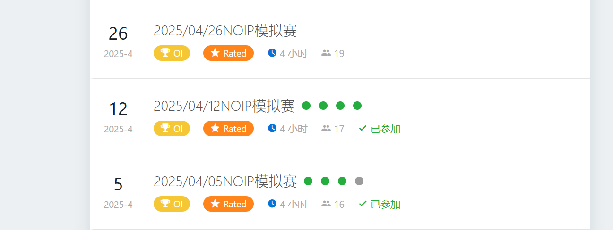
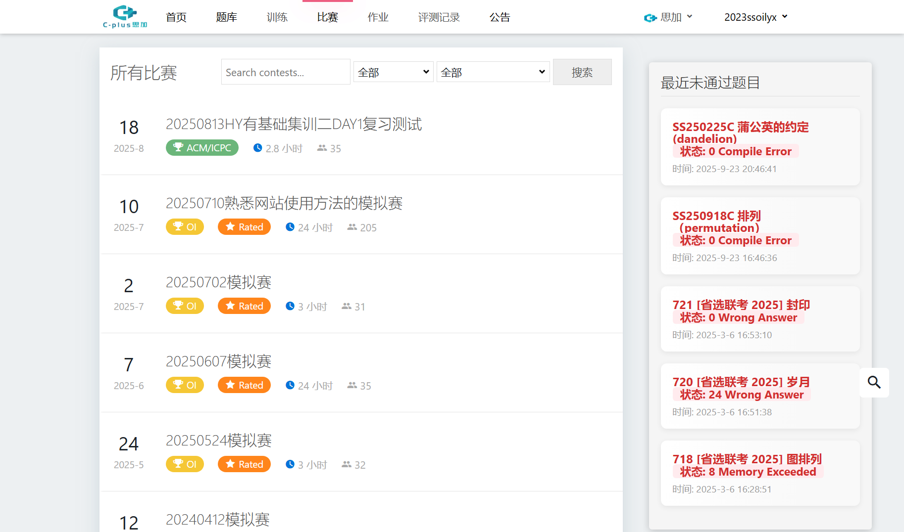
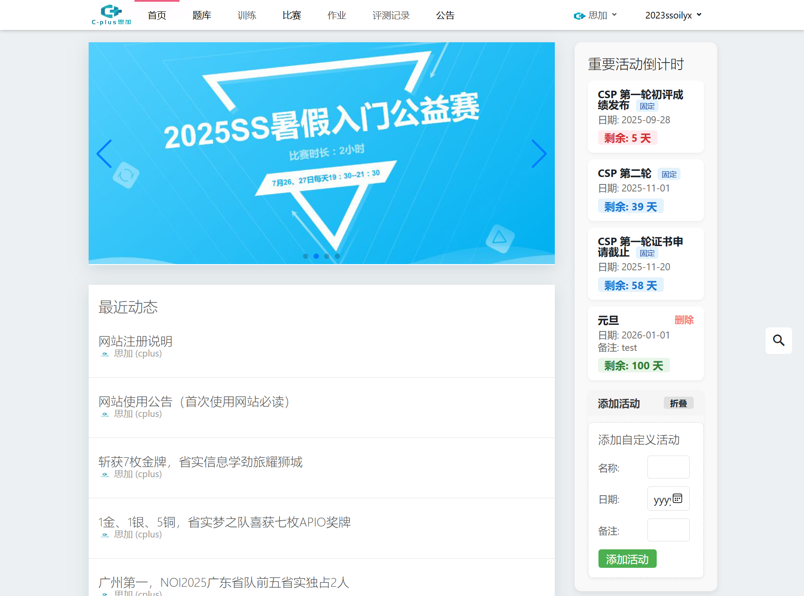

# cplus-better

需要篡改猴。

把脚本代码下载下来，在篡改猴新建脚本，然后粘贴代码上去即可。

目前包含三个脚本。使用豆包制作。

目前只有亮色模式的 UI。

欢迎反馈 BUG 及提 issues。

## cplusoj 补题情况

对已参加的比赛，以 zroj 风格展示补题情况。

绿色代表通过，灰色代表未通过。

效果展示：



------------

todo:

1. 支持 IOI 赛制。
2. 支持未参加的比赛。
3. 支持暗色模式。

## cplusoj 未通过题目展示器

请在脚本代码开头添加你的所有域的地址。

```js
 // 重要！！请在这里补充所有域的地址！！
 function getAllDomains() {
     // 支持主域和所有 /d/<子域> 格式
     return [
         'http://cplusoj.com',
         'http://cplusoj.com/d/senior',
         'http://cplusoj.com/d/master'
     ];
 }
```

在比赛界面展示所以域最近已尝试，未通过的 $5$ 道题目。

效果展示：



todo：

1. 优化爬取速度。
2. 显示题目所处域和比赛。
3. 支持暗色模式。

## cplusoj 重要活动倒计时

在首页显示重要活动倒计时。

在仓库的 `倒计时.json` 中设置固定活动。

还支持自定义活动。

- 已过期活动显示灰色；
- 天数 $\le 7$ 天活动显示红色；
- 天数 $\le 28$ 天活动显示橙色；
- 天数 $\le 60$ 天活动显示蓝色
- 天数 $> 60$ 天活动显示绿色。

效果展示：



------------

todo：

1. 支持暗色模式。

## 更新日志


### 2025.09.23

建立仓库，写好三个脚本最基本的功能。基本能用了。