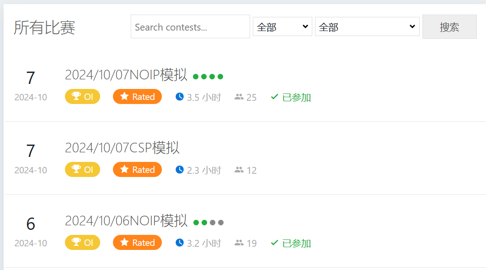
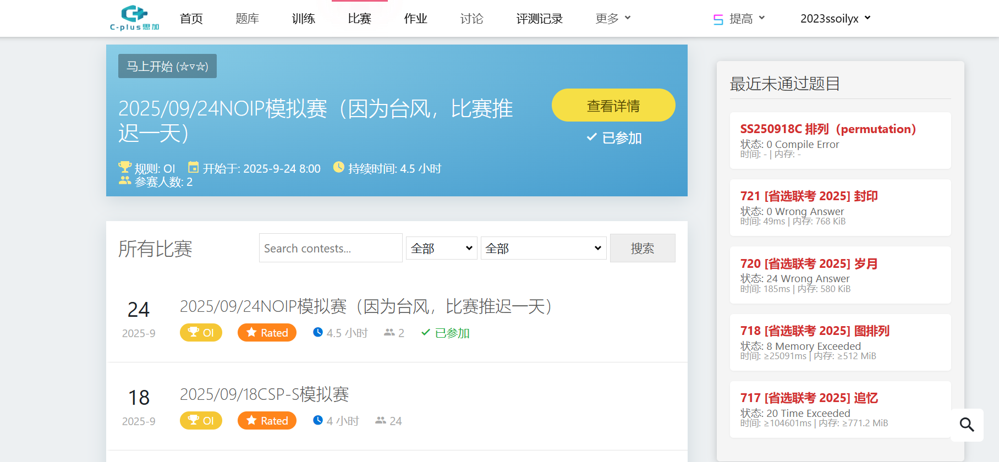

# cplus-better

需要篡改猴。

把脚本代码下载下来，在篡改猴新建脚本，然后粘贴代码上去即可。

目前包含两个脚本。使用豆包制作。

欢迎反馈 BUG 及提 issues。

## cplusoj 补题情况

对已参加的比赛，以 zroj 风格展示补题情况。

绿色代表通过，灰色代表未通过。

效果展示：

## cplusoj 未通过题目展示器

在比赛界面展示最近已尝试，未通过的 $5$ 道题目。

效果展示：

